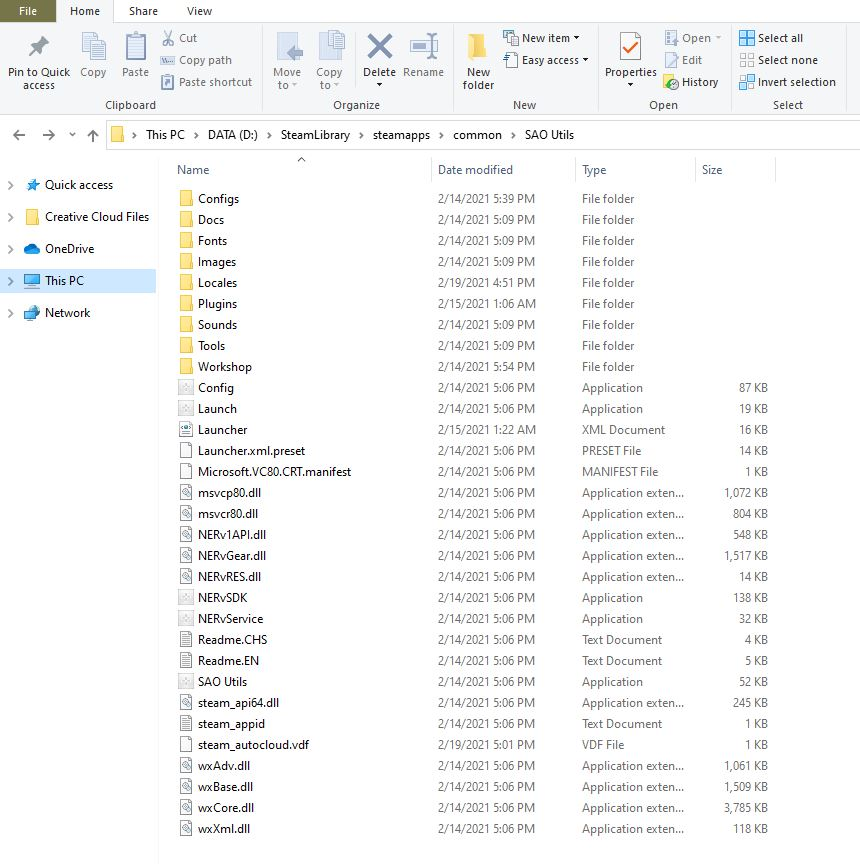

# SAO-Utils-Patch-lang-fr

![SAO Utils Patch[FR]](Images/final.jpg)

## There is my translated Patch for SAO Utils.

SAO Utils is a Full-Dive 3D app launcher with varieties of themes, desktop widgets and powerful utilities. 
I'm not the owner of this software.

My patch is a non-official patch create only for volunteering for thoses persons who don't know anything about the english language.

## Installation des fichiers traduits

Pour une utilisation plus rapide pour vous, je vous propose deux alternatives.
La première sera de "drag and past". Vous téléchargerez le fichier "SAO-utils-Patch-FR.zip" de l'extraire et de remplacer les fichiers d'origines d'SAO utils par les nouveaux.

la seconde qui est la même chose, seulement vous devez tout faire manuellement, ce qui est plus long.

Avant de commencer, si vous utilisez SAO utils depuis la plateforme Steam, sachez que la langue normalement par défaut est l'anglais.
Mes fichiers traduits sont bien évidemment en français mais renommés "en_US" (Anglophone).
Vous simulerez à steam que vous utilisez des fichiers anglais qui seront traduits en français. Compliqué ou bizarre, c'est la seule manière vu que mon patch n'est pas officiel :)

## Installation rapide

1) Veuillez vous diriger dans les fichiers locaux de SAO utils.

> Note: Si vous utilisez le chemin par défaut, veuillez donc vous diriger içi :
 C:\Program Files (x86)\Steam\steamapps\common\SAO Utils.
 
2) Veuillez ensuite télécharger le fichier [SAO-utils-Patch-FR.zip](SAO-utils-Patch-FR.zip).

3) Veuillez ensuite ouvrir/extraire ce fichier.zip.

3) veuillez ensuite glisser les fichiers "Locales" et "Plugins" du fichier zippé dans les fichiers locaux de SAO utiles.

4) Relancez SAO Utils et profitez :)

## Installation manuelle

1) Veuillez vous diriger dans les fichiers locaux de SAO utils.

> Note: Si vous utilisez le chemin par défaut, veuillez donc vous diriger içi :
 C:\Program Files (x86)\Steam\steamapps\common\SAO Utils.

Si vous n'utilisez pas SAO Utils depuis la plateforme Steam, clic droit sur l'icone SAO Utils et "Emplacement des fichiers".

2) Veuillez vous rendre dans le 'Locales' de la racine de SAO utils.

> Note: \SAO Utils\Locales

3) Veuillez ensuite créer un nouveau fichier renommé "fr_FR".

4) Veuillez ensuite télécharger les fichiers traduits.

| Fichier GitHub | .mo |
| ------ | ------ |
| fr_FR | [cfg.mo](Locales/fr_FR/cfg.mo)  |
| fr_FR | [std.mo](Locales/fr_FR/std.mo)  |
| fr_FR | [ui.mo](Locales/fr_FR/ui.mo)  |

5) Veuillez maintenant déposer les fichiers téléchargers dans ce nouveau fichier.

Bravo, vous disposez des à présent de SAO Utiles en français. 
Néanmoins, vous disposez d'une traduction incomplète.
Souhaitez-vous disposer des 15+ plugins disponibles par défaut traduits en français? Si vous le souhaitez, continuez alors de lire et je vous indiquerais les démarches.

## Plugins

| Plugin | .mo |
| ------ | ------ |
| Bangumi | [fr_FR.mo](Plugins/Bangumi/Locales/fr_FR.mo) |
| Cardinal System | [fr_FR.mo](Plugins/Bangumi/Locales/fr_FR.mo) |
| GGO Theme | [fr_FR.mo](Plugins/Bangumi/Locales/fr_FR.mo) |
| GGO Widget | [fr_FR.mo](Plugins/Bangumi/Locales/fr_FR.mo) |
| HP-Bar | [fr_FR.mo](Plugins/Bangumi/Locales/fr_FR.mo) |
| Image Widget | [fr_FR.mo](Plugins/Bangumi/Locales/fr_FR.mo) |
| Mail Box | [fr_FR.mo](Plugins/Bangumi/Locales/fr_FR.mo) |
| Music Player Support | [fr_FR.mo](Plugins/Bangumi/Locales/fr_FR.mo) |
| Pdh Data Extension | [fr_FR.mo](Plugins/Bangumi/Locales/fr_FR.mo) |
| Quick Launch | [fr_FR.mo](Plugins/Bangumi/Locales/fr_FR.mo) |
| SAO Theme | [fr_FR.mo](Plugins/Bangumi/Locales/fr_FR.mo) |
| Sensor Data Extension | [fr_FR.mo](Plugins/Bangumi/Locales/fr_FR.mo) |
| Shortcut Keys Extension | [fr_FR.mo](Plugins/Bangumi/Locales/fr_FR.mo) |
| Weather Data Extension | [fr_FR.mo](Plugins/Bangumi/Locales/fr_FR.mo) |
| Web Browser Engine | [fr_FR.mo](Plugins/Bangumi/Locales/fr_FR.mo) |
| Web Widget | [fr_FR.mo](Plugins/Bangumi/Locales/fr_FR.mo) |

La méthode est la même à la différence qu'il y n'aura qu'un seul fichier (fr_FR.mo) a ajouter.

1) Veuillez vous diriger dans les fichiers locaux de SAO utils.

2) Veuillez vous rendre dans le 'Plugins' de la racine de SAO utils.

> Note: \SAO Utils\Plugins

3) Veuillez ensuite créer un nouveau fichier renommé "fr_FR" dans chacun des plugins.

> Note: SAO Utils\Plugins\Bangumi\Locales / nouveau fichier renommé "fr_FR"

4) Veuillez ensuite télécharger les fichiers traduits disponibles sur le tableau plus haut.

5) Veuillez maintenant déposer les fichiers téléchargés dans ces nouveaux fichiers.

Bravo, vous disposez dès a présent de SAO Utils et ces plugins traduit à 99% en français.

> Note: 
Durant l'installation manuelle, les fichiers sont renommés "fr_FR". Ils fonctionneront que s'ils sont renommés "en_US".

## License

Je ne dispose d'aucun droit d'auteur et mon patch est non officiel.
Il est pour but d'aider ceux ne comprenant pas l'anglais ou ceux voulant profiter d'une interface en français.

**Veuillez noter que mes fichiers seront mis à jour si révision ou nouveaux éléments ajoutés par l'auteur de SAO Utils**